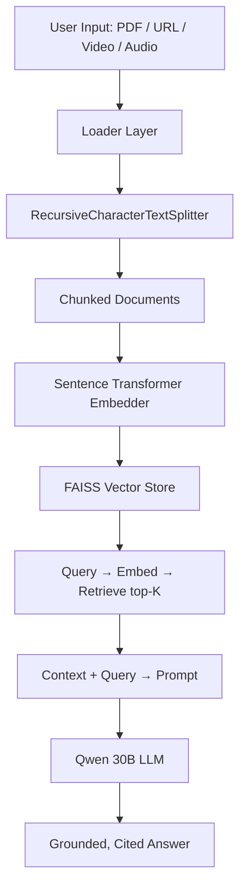

# 🚀 Multi-Modal Retrieval-Augmented Generation (RAG) System

Production-oriented **multi-source RAG** application that ingests documents, web pages, videos & audio → builds a persistent vector knowledge base → and answers questions grounded **strictly** in the provided content using a powerful LLM.

[](https://postimg.cc/R3288WfK)

**Focus:** System design • Correct data flow • Real RAG engineering — not just calling an LLM API.

---

## ✨ Key Features

- 📂 **Multi-modal ingestion** — PDFs • Text • Word • Web URLs • YouTube/general videos • Audio (transcription)
- ✂️ **Intelligent semantic chunking** — `RecursiveCharacterTextSplitter`
- 🧠 **High-quality embeddings** — Sentence Transformers (HuggingFace)
- ⚡ **Fast & lightweight vector search** — FAISS
- 🔍 **Multi-contextual retriever** with metadata filtering support
- 🤖 **Grounded generation** — Qwen 30B (via Groq or local)
- 🌐 **Clean Flask web UI** for upload + querying
- 🧱 **Modular, maintainable, scalable architecture**

---

## 🧠 High-Level Architecture



---

## 📁 Project Structure

```
.
├── app.py                      # Flask entry point
├── templates/
│   ├── query.html              # Query + upload UI
│   └── results.html            # Answer + sources display
├── services/
│   ├── ingestion/              # PDF, web, YouTube, audio loaders
│   ├── embedding.py            # Embedder wrapper
│   ├── faiss_db.py             # FAISS vector store management
│   ├── retriever.py            # Retrieval logic + re-ranking (optional)
│   └── gen.py                  # LLM prompt + generation
├── utility/
│   ├── logger.py
│   └── error_handling.py
├── vector_db/                  # (gitignored) persisted FAISS index
├── .env
├── requirements.txt
└── README.md
```

---

## 🔄 End-to-End Pipeline

### 1️⃣ User Input
- Upload files (PDF, docx, txt…) or paste URL(s)

### 2️⃣ Ingestion & Processing
- Type-specific loader
- Text extraction / transcription
- `RecursiveCharacterTextSplitter` (with overlap)

### 3️⃣ Embedding
- `all-MiniLM-L6-v2` (normalized embeddings)

### 4️⃣ Storage
- FAISS `IndexFlatL2` (cosine similarity via normalization)
- Persistent `save_local()` / `load_local()`

### 5️⃣ Query Flow
1. Query → embed → FAISS → top-K chunks
2. Enrich context with source metadata
3. Strict system prompt → Qwen-32B
4. **Output:** Answer strictly grounded in retrieved content
5. *(Planned: chunk-level citations & highlighting)*

---

## 🛡️ Critical Engineering Lessons

| Issue | Symptom | Solution |
|-------|---------|----------|
| Multiple FAISS instances | Retrieval returns no results | Single shared instance (module-level or DI) |
| Knowledge lost on restart | DB empty after app restart | Explicit save/load logic at startup |
| Embedding model mismatch | Dimension error on load | Same embedder instance used for save & load |
| Double initialization / slow boot | Duplicate model loading | Controlled boot sequence or lazy properties |

---

## 🚀 Quick Start

```bash
# 1. Clone & enter directory
git clone <repository-url>
cd <project-directory>

# 2. Install dependencies
pip install -r requirements.txt

# 3. (Recommended) Create .env file
echo "GROQ_API_KEY=gsk_xxxxxxxxxxxxxxxxxxxxxxxx" > .env

# 4. Run the app
python app.py
```

**→ Open:** `http://127.0.0.1:5000`

---

## 🛠 Tech Stack

| Component | Technology |
|-----------|------------|
| **Web Framework** | Flask |
| **Embeddings** | sentence-transformers (`all-MiniLM-L6-v2`) |
| **Vector Store** | FAISS |
| **LLM** | Qwen / qwen3-32b (Groq API) |
| **Document Loaders** | LangChain loaders + yt-dlp / whisper (planned) |
| **Frontend** | Jinja2 + Bootstrap |

---

## 🌟 Roadmap / Future Enhancements

- [ ] Async / background ingestion pipeline
- [ ] User/session-based vector namespaces
- [ ] Source citations + chunk highlighting
- [ ] Streaming LLM responses
- [ ] FastAPI + WebSocket upgrade
- [ ] Hybrid retrieval (BM25 + semantic)
- [ ] RAG evaluation (RAGAS, faithfulness, answer relevance)

---


---

## 📌 Final Note


If you understand the architecture and trade-offs in this project, you understand how modern RAG systems are actually built in 2025–2026.

**Happy building! 🚀**

---

## 📄 License

*MIT*

## 🤝 Contributing

Contributions, issues, and feature requests are welcome!

---

**⭐ If you find this project helpful, please give it a star!**